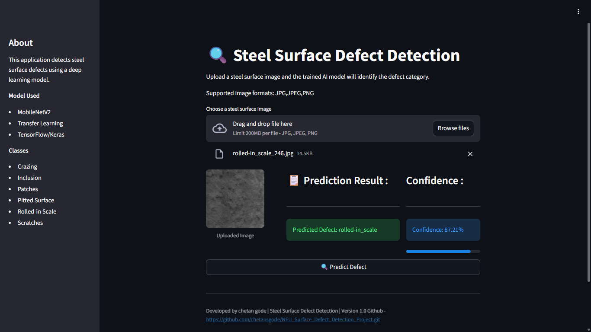
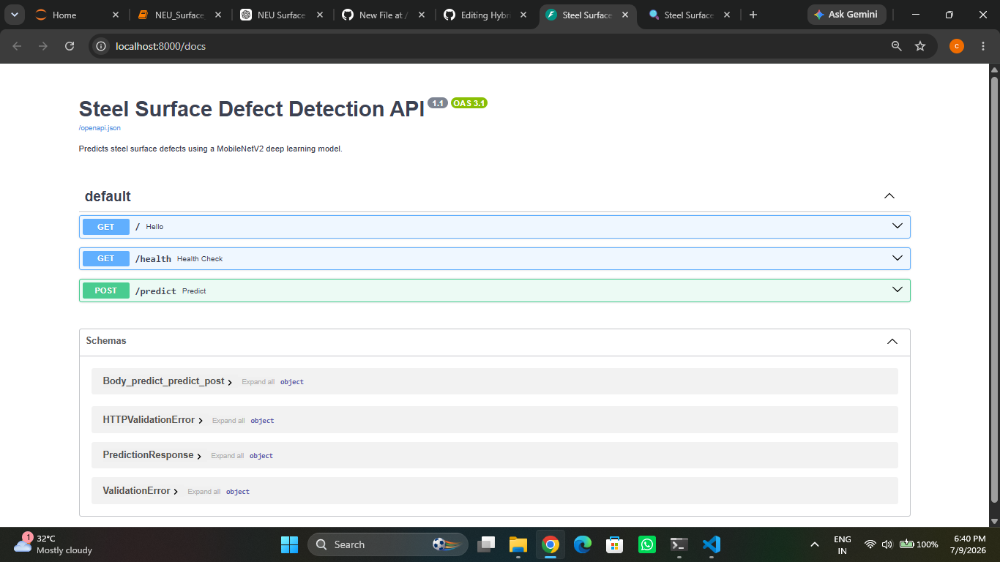

# 🔍 Steel Surface Defect Detection using Deep Learning, FastAPI, Streamlit and Docker

## Project Description

This project is an end-to-end Deep Learning application that automatically detects and classifies defects on steel surfaces from images. The system is built using **TensorFlow/Keras**, served through a **FastAPI** backend, and provides an interactive user interface using **Streamlit**. The entire application is containerized using **Docker**, making it portable and easy to deploy.

The trained model classifies steel surface images into one of six defect categories and returns both the predicted class and its confidence score.

---

# Problem Statement

Manual inspection of steel surfaces is time-consuming, expensive, and prone to human error. Automated visual inspection using Deep Learning helps manufacturers improve quality control by detecting defects quickly and consistently.

This project aims to:

* Automatically detect steel surface defects
* Reduce manual inspection effort
* Improve inspection consistency
* Provide fast predictions through a REST API
* Offer an easy-to-use web interface
* Package the complete application using Docker

---

# Features

* Deep Learning based image classification
* MobileNetV2 Transfer Learning model
* FastAPI backend for prediction APIs
* Interactive Streamlit dashboard
* Upload JPG, JPEG and PNG images
* Displays predicted defect class
* Shows prediction confidence score
* Progress bar for confidence visualization
* Input image validation
* Health Check API
* Dockerized backend and frontend
* One-Click Docker execution using Batch files

---

# Architecture

```text
                User
                  │
                  ▼
      Streamlit Web Application
                  │
                  ▼
            FastAPI Backend
                  │
                  ▼
      MobileNetV2 Deep Learning Model
                  │
                  ▼
          Prediction Response
```

---

# Screenshots

## Streamlit Dashboard



## FastAPI Swagger UI




---

## Dataset

**Dataset:** NEU Surface Defect Database 

- The dataset contains grayscale images of hot-rolled steel surface defects.

Source:
https://www.kaggle.com/datasets/kaustubhdikshit/neu-surface-defect-database


### Classes

* Crazing
* Inclusion
* Patches
* Pitted Surface
* Rolled-in Scale
* Scratches

---

# Exploratory Data Analysis (EDA)

Exploratory analysis was performed before model training.

Performed analysis:

* Class distribution
* Image dimensions
* Sample visualization
* Dataset balance verification

---

# Data Preprocessing

The following preprocessing steps were applied:

* Image resizing
* Image normalization
* Label encoding
* Dataset splitting
* TensorFlow preprocessing pipeline

---

# Data Augmentation

To improve model generalization, the following augmentations were applied:

* Rotation
* Width shift
* Height shift
* Horizontal flip
* Zoom
* Brightness adjustment

---

# Model Development

Several Deep Learning approaches were explored.

## Baseline CNN

A custom CNN model was initially developed for comparison.

## Transfer Learning

Transfer Learning was implemented using:

* MobileNetV2

The pretrained ImageNet weights were fine-tuned for steel surface defect classification.

## Model Performance Comparison

| Model | Train Accuracy | Validation Accuracy | Test Accuracy | Test Loss | Status |
|-------|---------------:|--------------------:|--------------:|----------:|--------|
| ANN | 19.62% | 17.36% | 16.11% | 5.4556 | Baseline |
| CNN | 86.46% | 76.39% | 63.33% | 1.1096 | Improved |
| CNN + Augmentation | 71.44% | 65.28% | 63.89% | 0.9104 | Improved |
| MobileNetV2 (Frozen, No Preprocessing) | 99.57% | 98.96% | 97.78% | 0.0736 | Excellent |
| **MobileNetV2 (Frozen, Preprocessing)** | **99.13%** | **98.96%** | **98.06%** | **0.0755** | ✅ **Selected** |
| MobileNetV2 (Fine-tuned) | 99.65% | 99.65% | **98.89%** | **0.0350** | Experimental |
| EfficientNetV2B0 | 97.66% | 96.53% | 95.83% | 0.2296 | Alternative |

---

## Model Selection

A total of **13 Deep Learning models** were developed and evaluated, including ANN, multiple CNN architectures, MobileNetV2 variants, and EfficientNetV2B0.

Although the **MobileNetV2 (Fine-tuned)** model achieved slightly higher evaluation metrics, the **MobileNetV2 (Frozen, Preprocessing)** model was selected for deployment because it provided stable inference, consistent prediction performance during testing, and efficient deployment characteristics while maintaining excellent classification accuracy.

---

## Final Model

The **MobileNetV2 (Frozen, Preprocessing)** model was selected as the final production model. 

### Model Details

| Item | Value |
|------|------|
| Architecture | MobileNetV2 |
| Transfer Learning | Yes |
| Input Size | 224 × 224 |
| Number of Classes | 6 |
| Framework | TensorFlow / Keras |

### Final Model Performance

| Metric | Value |
|--------|------:|
| Training Accuracy | **99.13%** |
| Validation Accuracy | **98.96%** |
| Test Accuracy | **98.06%** |
| Test Loss | **0.0755** |

### Why MobileNetV2?

- ✅ Lightweight architecture
- ✅ Fast inference speed
- ✅ High classification accuracy
- ✅ Good generalization on unseen images
- ✅ Suitable for real-time deployment
- ✅ Efficient integration with FastAPI and Docker


---

# Model Evaluation

The model was evaluated using:

* Accuracy
* Precision
* Recall
* F1 Score
* Confusion Matrix
* Classification Report

---

# Prediction Pipeline

The prediction workflow is:

1. Upload image
2. Validate file type
3. Save image temporarily
4. Preprocess image
5. Load trained model
6. Predict defect class
7. Return confidence score
8. Display result in Streamlit

---

# FastAPI Endpoints

| Endpoint   | Method | Description          |
| ---------- | ------ | -------------------- |
| `/`        | GET    | Welcome message      |
| `/health`  | GET    | Health Check         |
| `/predict` | POST   | Predict steel defect |

Swagger Documentation:

```
http://localhost:8000/docs
```

---

# Tech Stack

| Category             | Technologies      |
| -------------------- | ----------------- |
| Programming Language | Python            |
| Deep Learning        | TensorFlow, Keras |
| Model                | MobileNetV2       |
| Data Processing      | NumPy, Pandas     |
| Image Processing     | OpenCV, Pillow    |
| Backend API          | FastAPI           |
| Data Validation      | Pydantic          |
| Frontend             | Streamlit         |
| Containerization     | Docker            |
| Orchestration        | Docker Compose    |
| Development          | Jupyter Notebook  |
| Version Control      | Git, GitHub       |

---

# Project Structure

```text
steel_defect_project/
│
├── api/
│   ├── main.py
│   ├── predictor.py
│   ├── schema.py
│   ├── class_names.json
│   ├── steel_defect_classifier.keras
│   └── requirements_api.txt
│
├── streamlit_app/
│   ├── app.py
│   └── requirements_app.txt
│
├── Dockerfile/
│   ├── Dockerfile.api
│   ├── Dockerfile.streamlit
│   └── docker-compose.yml
│
├── Dockerfile_OneClickRun/
│   ├── start.bat
│   └── stop.bat
│
├── data/
├── notebook/
├── README.md
└── .dockerignore
```

---

# 🐳 Docker Setup

## Option 1 : Full Project

### Clone Repository

```bash
git clone https://github.com/chetansgode/NEU_Surface_Defect_Detection_Project.git
```

Navigate to project folder

```bash
cd steel_defect_project
```

Run Docker Compose

```bash
docker compose -f Dockerfile/docker-compose.yml up --build
```

Access Application

Streamlit

```
http://localhost:8501
```

FastAPI

```
http://localhost:8000
```

Swagger

```
http://localhost:8000/docs
```

Stop Containers

```bash
docker compose -f Dockerfile/docker-compose.yml down
```

---

## Option 2 : One Click Run (Recommended)

Install Docker Desktop and ensure it is running.

Download only:

```text
Dockerfile_OneClickRun/
```

Run

```
start.bat
```

The script automatically:

* Builds images (if needed)
* Starts FastAPI
* Starts Streamlit
* Creates required containers

To stop:

```
stop.bat
```

Access

Streamlit

```
http://localhost:8501
```

Swagger

```
http://localhost:8000/docs
```

---

# Results

The project successfully demonstrates:

* Automatic steel defect classification
* End-to-end Deep Learning deployment
* REST API integration
* Interactive Streamlit dashboard
* Dockerized deployment
* One-click application startup

---

# Limitations

* Trained on a single dataset
* Supports only six defect classes
* No cloud deployment
* Requires Docker for containerized execution

---

# Future Work

* Train on larger industrial datasets
* Add Grad-CAM model explainability
* Deploy on AWS, Azure or GCP
* Support real-time camera prediction
* Add batch image prediction
* Improve mobile compatibility

---

# Conclusion

This project demonstrates a complete Deep Learning workflow from data preprocessing and model training to API development, frontend integration, and Docker deployment. The application provides a scalable solution for automated steel surface defect detection and serves as a practical example of deploying computer vision models in production.

---

# Author

**Chetan S. Gode**

Machine Learning • Deep Learning • Computer Vision • FastAPI • Streamlit • Docker

- GitHub: https://github.com/chetansgode
- LinkedIn: <www.linkedin.com/in/chetan-gode-s0502>
